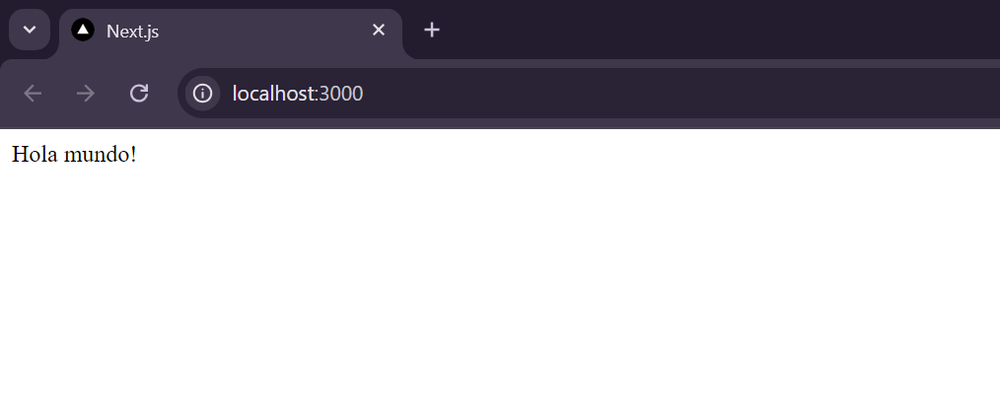
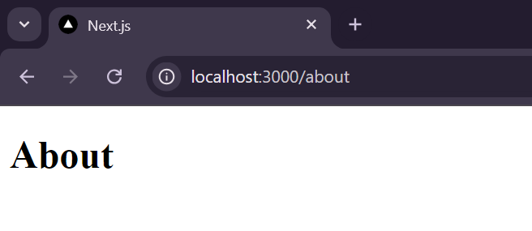

# **Rutas en NextJS**

La carpeta app contendrá nuestro proyecto en si

Dentro podemos crear el archivo page y el layout (aunque este ultimo puede crearse automáticamente al ejecutarse con solo el archivo page)

Estos archivos y los de los componentes pueden tener las extensiones .js, .jsx o si estamos trabajando con typescript, .ts o .tsx

Estos dos archivos van de la mano, el layout es como una "plantilla" o contenedor y el page es el contenido que tendrá el layout.

Los archivos layout y page que están inmediatamente dentro de la carpeta app son tomados como vista principal, como si fueran el index

A este termino también se le aplica anidación, es decir, si tenemos otra carpeta dentro de app y dentro de esa carpeta solo existe el archivo page, el layout que contendrá este page será su padre inmediato, es decir, el que esta inmediatamente dentro de app

### **Ejemplo:**

Tenemos nuestra carpeta app:

```
app/
 |--layout.ts
 |--page.jsx
```

layout.js (Básicamente el parámetro children es el componente que recibe de page)

```js
export const metadata = {
  title: 'Next.js',
  description: 'Generated by Next.js',
}
  
export default function RootLayout({ children }) {
  return (
    <html lang="en">
      <body>{children}</body>
    </html>
  )
}
```

page.jsx

```js
export default function Home(){
    return (<div>Hola mundo!</div>);
}
```

Obteniendo así




---

## **Creación de rutas (Sistema de enrutamiento basado en archivos)** 

Para crear rutas a ciertas paginas en nuestro sitio web debemos crear carpetas con el nombre de la ruta, por ejemplo:

```
app/
 |--about/
 |   |--page.jsx
 |--layout.js
 |--page.jsx
```

En este caso estamos creando una carpeta llamada about para crear una ruta 
Como en la carpeta about no existe el archivo layout, el page tomara el layout del hijo inmediato de app

Ahora podemos buscar la ruta en el navegador que seria localhost:3000/about



Y básicamente así funcionan las rutas en NextJs, mediante carpetas

*Nota:* La ruta se llamara igual que la carpeta
