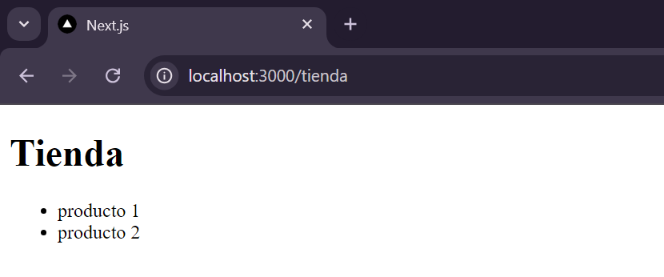
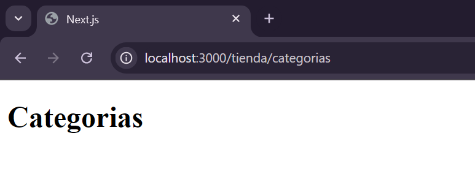
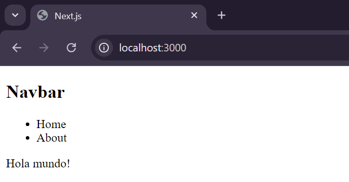
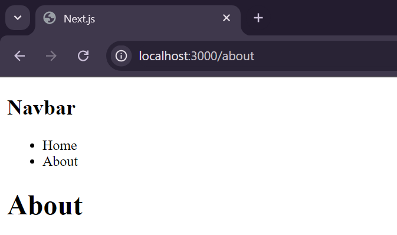
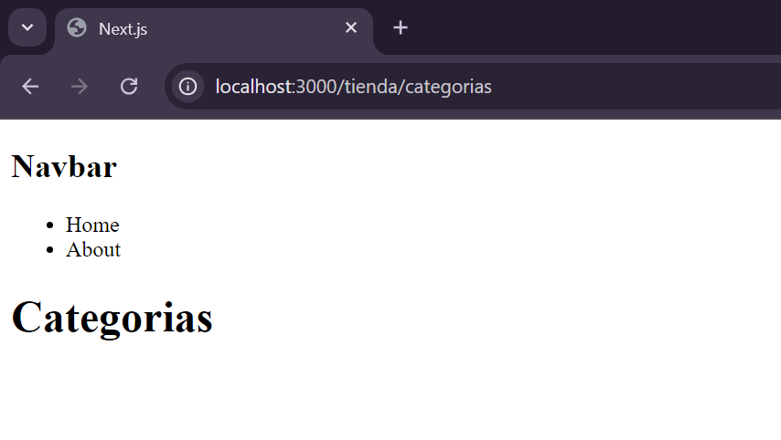

# **Rutas anidadas**

Es el principio descrito anteriormente, solo debemos tener carpetas anidadas, obviamente cada pagina con su archivo page

Tenemos la siguiente estructura

```
app/
 |--about/
 |   |--pages.jsx
 |--tienda/
 |   |--categorias/
 |   |    |--page.jsx
 |   |--page.jsx
 |--layout.js
 |--page.jsx
```

Obteniendo asi 





Como en ninguna carpeta existe un archivo layout, todos los archivos page toman como contenedor el layout principal

**Ejemplo**

Si modificamos el layout a:

```js
export const metadata = {
  title: 'Next.js',
  description: 'Generated by Next.js',
}
 
export default function RootLayout({ children }) {
  return (
    <html lang="en">
      <body>
        <nav>
          <h1>Navbar</h1>
          <ul>
            <li>Home</li>
            <li>About</li>
          </ul>
        </nav>
        {children}
      </body>
    </html>
  )
}
```

Obtenemos en las paginas: 







