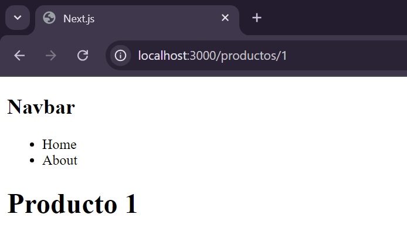
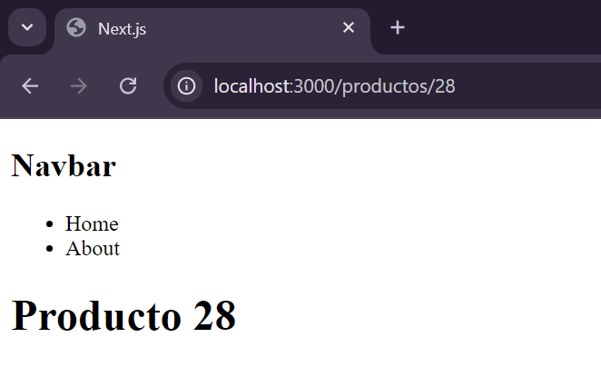
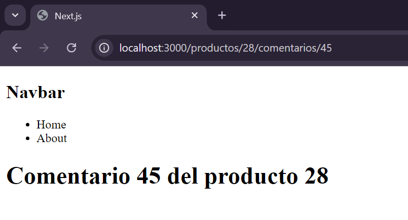

# **Rutas dinámicas**

Las rutas dinámicas nos permiten el paso de parámetros mediante la url, lo que nos permite crear infinitas paginas

Para definir una pagina o ruta que recibirá parámetros, creamos la carpeta pero entre corchetes \[ ], y lo que este dentro de los corchetes es el parámetro 

Ejemplo, tenemos la siguiente estructura:

```
app/
 |--productos/
 |   |--[productoId]/
 |   |    |--page.jsx
 |   |--page.jsx
```

Para hacer uso de este parámetro en código, lo recibimos como parámetro en el componente de page de la carpeta entre corchetes 

*Nota:* El nombre de la variable debe ser el mismo que el de la carpeta

```js
export default function ProductDetail({params}){
    return <h1>Producto {params.productId}</h1>
}
```

Quedándonos así





Cabe aclarar que dentro de esta carpeta de corchetes también podemos tener anidamiento ya sean carpetas (rutas) normales y/o dinámicas

Si tenemos rutas dinámicas anidadas, la de mas bajo nivel tiene acceso a los parámetros de las anteriores rutas

Por ejemplo, si tenemos la siguiente estructura 

```
app/
 |--productos/
 |   |--[productoId]/
 |   |    |--comentarios/
 |   |    |   |--[comentarioId]/
 |   |    |   |    |--page.jsx
 |   |    |   |--page.jsx
 |   |    |--page.jsx
 |   |--page.jsx
```

El archivo page de \[comentarioId]/ tiene acceso a \[productoId]

archivo page de \[comentarioId]/

```js
export default function ComentarioProducto({params}){
    return <h1>Comentario {params.commentId} del producto {params.productId}</h1>
}
```

Obteniendo así



