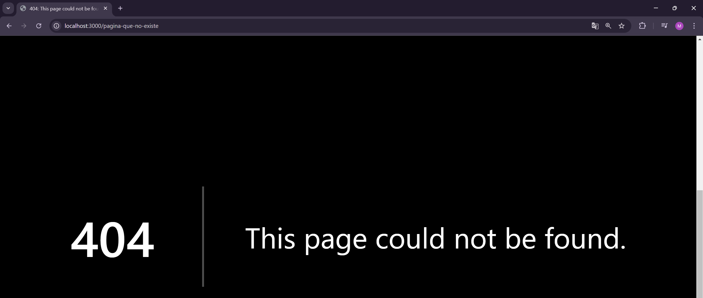

# **Rutas de pagina no encontrada (error 404)**

NextJS por defecto ya tiene una pagina que mostrar en caso de no encontrar la pagina buscada



Para tener una pagina de error 404 personalizada debemos crear un archivo not-found.jsx (o tsx según sea el caso) en la carpeta app

Archivo not-found.jsx

```js
export default function NotFound(){
    return <h1>Error 404 - Not Found</h1>
}
```

Básicamente es un componente que se mostrará en caso de no encontrar la ruta en nuestro proyecto

