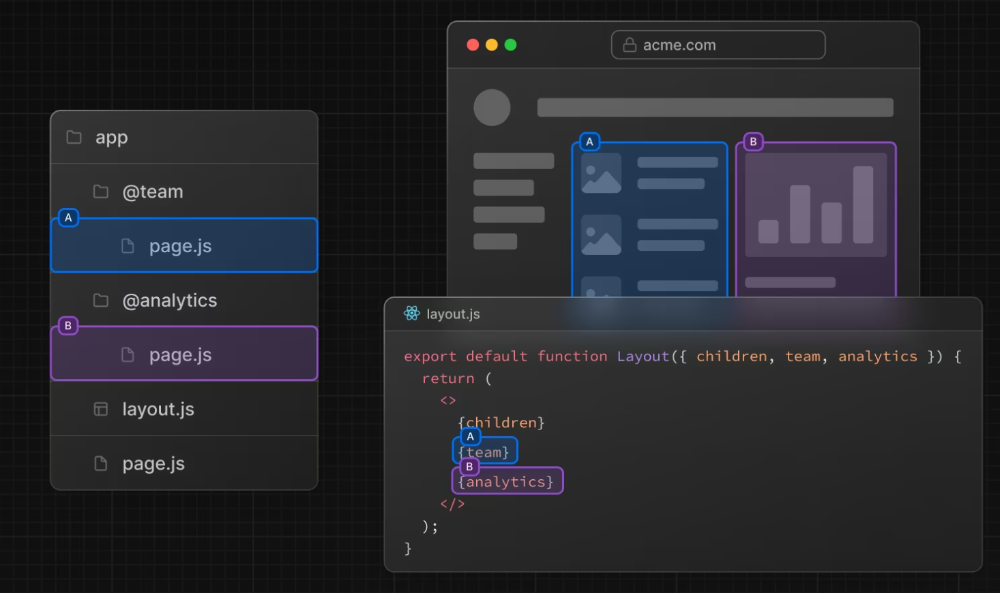

# **Rutas paralelas**

Las rutas paralelas permiten representar de forma simultánea o condicional una o más páginas dentro del mismo diseño. Son útiles para secciones muy dinámicas de una aplicación, como paneles y feeds en sitios sociales, por ejemplo twitch, que en un lado esta el stream, por otro lado tenemos el chat, etc



Como vemos en el ejemplo, solo basta con nombrar las carpetas (rutas) empezando con un @

*Nota:* Estas carpetas con el @ no pueden ser distinguidas por la url, es decir, no podemos buscarlas individualmente

Basándonos en la fotografía anterior, no podemos buscar localhost:3000/team ni localhost:3000/@team

**Ejemplo:**

```
app/
 |--dashboard/
 |   |--@analitycs/
 |   |   |--page.jsx
 |   |--@chat/
 |   |   |--page.jsx
 |   |--@video/
 |   |   |--page.jsx
 |   |--layout.jsx
 |   |--page.jsx
 |--layout.jsx
 |--page.jsx
```

Archivo layout dentro de dashboard
```js
export default function DashboardLayout({children, analitycs, chat, video}){
    return(
        <>
            <article>
                {children}
            </article>
            <section>
                <aside>{analitycs}</aside>
                <aside>{chat}</aside>
                <aside>{video}</aside>    
            </section>
        </>
    );
}
```

* children representa el componente de page dentro de dashboard
* analitycs representa el componente de page dentro de @analitycs
* chat representa el componente de page dentro de @chat
* video representa el componente de page dentro de @video

*Nota:* Si las carpetas de nuestras rutas paralelas tienen como nombre dos palabras o mas, no debemos separarlas con guion medio, debemos separarlas con guion bajo